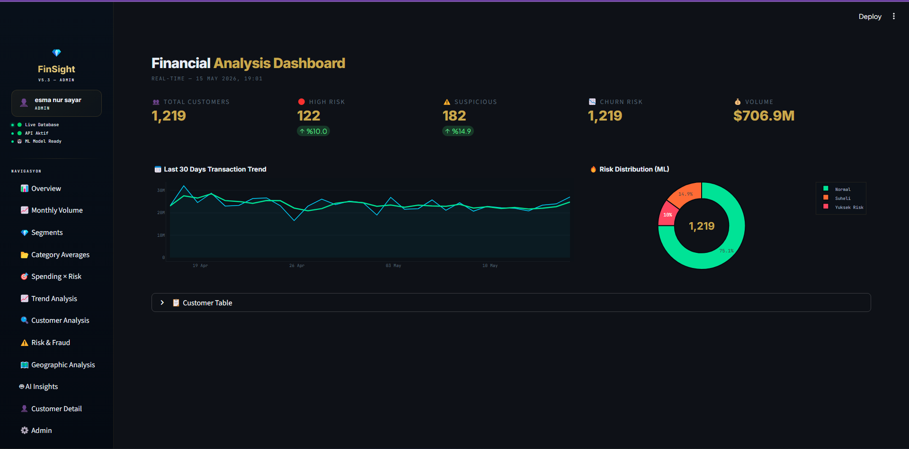
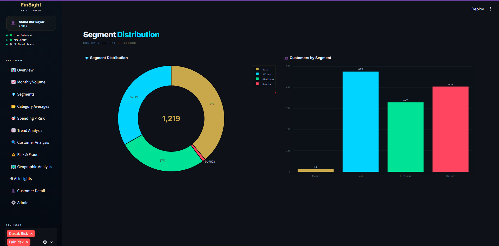
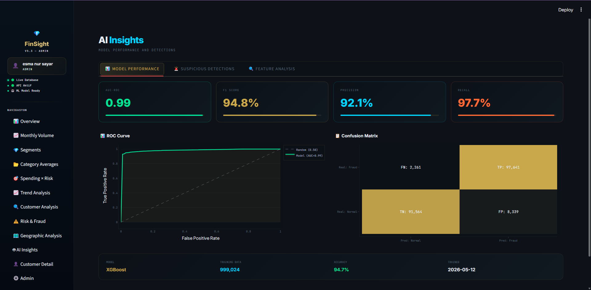
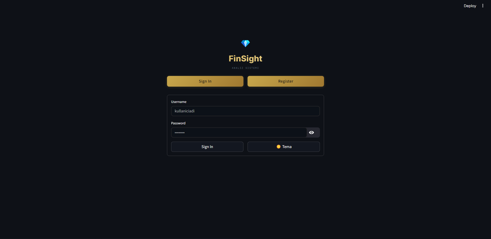

FINANCEAI

Proje Hakkında

FinanceAI, finansal işlemlerde dolandırıcılık tespiti (fraud detection) yapmak amacıyla geliştirilmiş bir makine öğrenmesi projesidir. Sistem, hem kart ve müşteri bilgilerini hem de kullanıcı işlem davranışlarını analiz ederek anormal aktiviteleri belirler ve risk skorlaması üretir.

Veri Yapısı ve Kullanımı

Veri seti büyük boyutlu olduğu için iki ayrı kaynak kullanılmıştır:

* financeai: Kart ve müşteri bilgileri (kart türü, kredi limiti, hesap açılış tarihi vb.)

\*auth: Kullanıcı işlem geçmişi ve davranışsal verileri (toplam harcama, işlem sayısı, hata sayısı vb.)

Bu iki veri seti, ortak anahtar client\_id üzerinden birleştirilir. Böylece her kullanıcı için finansal ve davranışsal bilgiler tek bir veri yapısında toplanmış olur.

Modelleme Yaklaşımı

* Hedef Değişken (Target):
card\_on\_dark\_web → Kart bilgilerinin sızdırılıp sızdırılmadığını gösterir.
* Bağımsız Değişkenler (Features):
Kart bilgileri, işlem verileri ve türetilmiş metrikler (ortalama işlem tutarı, işlem başına hata oranı vb.)
* Amaç:
Kullanıcı davranışlarını analiz ederek anormal işlem örüntülerini tespit etmek ve fraud riskini doğru şekilde tahmin etmek. Risk skorlaması ile kullanıcılar düşük, orta ve yüksek risk kategorilerine ayrılır.

Kurulum ve Kullanım

1. Repo’yu klonlayın:
git clone https://github.com/Esmasyr/financeai.git
cd financeai
2. Sanal ortam oluşturun ve aktif edin:
Windows: python -m venv venv ve venv\\Scripts\\activate
Mac/Linux: python -m venv venv ve source venv/bin/activate
3. Gerekli paketleri yükleyin:
pip install -r requirements.txt
4. Veri setini data/ klasörüne koyun ve proje dosyalarını çalıştırın.

Özellikler

* Fraud detection modeli (RandomForest veya XGBoost)
* Veri işleme ve feature engineering pipeline
* Risk skorlaması ve dinamik risk seviyeleri
* Kullanımı kolay ve genişletilebilir yapı

\-Ekran GÖRÜNTÜLERİ

<h2>📸 Dashboard Screenshots</h2>

  
  &nbsp;
  

  
  &nbsp;
  

